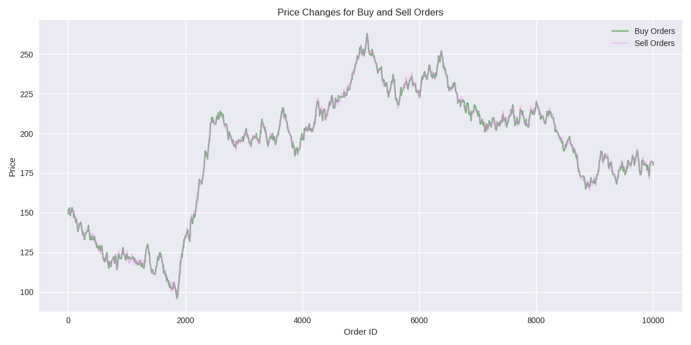

# Introduction

This repository presents a personal portfolio project, to demonstrate proficiency in C++, Python, CMake, and
performance measurement techniques, and an interest in low-latency systems and the financial domain.

The OrderBook implementation provides core functionalities, including the ability to add and cancel orders,
retrieve the best bid and ask prices, and compute the ask volume within specified price ranges.

The project is thoroughly unit-tested using the Google Test framework, with benchmarking and performance evaluations
conducted via Google Benchmark.

The dataset_creator/data_generator.py creates an example_dataset.csv that simulates incoming order messages.

The prices of orders are subject to random fluctuations, with biases designed to create upward and downward trends.
Prices remain closely correlated to facilitate a large volume of trades.

*Figure 1: Plot of prices created by the DataGenerator.py (plot by: plot_example_dataset_price.py)

The example dataset is processed by main.cpp, which uses the Orderbook class from OrderBook_lib.

# Version 1: std::priority_queue Implementation

This design was developed as a foundational exercise to establish the project architecture,
alongside unit testing and benchmarking capabilities.

The initial phase of this project involved a systematic approach, beginning with the integration of order management
into the OrderBook class. For this purpose, I employed `std::priority_queue`, which facilitates constant-time retrieval
of the optimal bid and ask prices—an essential feature for efficient trade execution. The bid and ask databases are
implemented as priority queues, with max-heaps for bids and min-heaps for asks.

However, this approach presents two notable limitations:

1. **Logarithmic Insertion**:  Orders are inserted with a time complexity of O(log N).
2. **Order Lookup**: Order Cancel, Best Bid, and Ask Volume all need Order lookup.
   Despite using hashmap for constant-time lookup of order IDs, priority_queue lacks direct removal from arbitrary
   indices.
   Cancelling an order requires popping elements to find the target, storing them temporarily, and then reinserting
   them.
   This results in O(NlogN) time and O(N) space complexity, where N is the lookup target order depth in the ask/bid
   priority queue.

***

## Benchmark results of Version 1:

 Benchmark system specs 

### Benchmark system specs

Testing was done on Ubuntu, with i5-12400F, 6cores, 4400Mhz. Cache sizes:

- **L1 Data**: 48 KiB (×6)
- **L2 Unified**: 1280 KiB (×6)
- **L3 Unified**: 18,432 KiB / 18 MiB (×1)

Tests executed with N in range 210 - 220, where N is the database size. The Time column and
AddOrder row therefore relates to adding an order to a database that already contains N orders.

| Test                      | Time Complexity | RMS  |
|---------------------------|-----------------|------|
| AddOrder_PriceRange_3     | 464.91 O(1)     | 2 %  |
| AddOrder_PriceRange_10    | 386.12 O(1)     | 5 %  |
| Add1_Cancel1_Random_Order | 34.48 O(NlgN)   | 13 % |
| GetAskVolumeBetweenPrices | 66.50 O(NlgN)   | 1 %  |
| GetBestBid                | 20.79 O(NlgN)   | 3 %  |

The insertion operation for `std::priority_queue` has a time complexity of O(log N), as detailed in the
[C++ reference documentation](https://en.cppreference.com/w/cpp/container/priority_queue).
In the Google benchmark, random prices within ranges of 3 and 10 were repeatedly added to the priority queue.
Given the high volume of operations and the absence of other CPU tasks during the benchmark, the operation appears
highly optimized, with performance approaching O(1). This suggests that the heap size has a minimal impact on
the time required to add additional elements. The relatively large constant factor of 465 indicates that the operation's
baseline cost is non-trivial. Furthermore, the benchmark demonstrates a slight performance improvement with a larger
price range of 10, likely due to a more even distribution of elements within the underlying container.
The other results align with expectations, showing O(NlogN) complexity for order lookups,
as theoretically predicted.

***

# Version 2: std::map + std::list

Version 2 focuses on optimizing data structures to improve the O(NlogN) time complexity associated with key operations,
including retrieving the best bid, canceling orders, and querying ask volumes within a specified price range.
This design is motivated by insights from a notable blog
post: [How to Build a Fast Limit Order Book](https://web.archive.org/web/20110219163448/http://howtohft.wordpress.com/2011/02/15/how-to-build-a-fast-limit-order-book/).

In this implementation, each price level is represented by a `Level` object, which holds a bidirectional linked list
(`std::list`) for holding orders. The price levels themselves are organized using a balanced binary search tree
(`std::map`), ensuring logarithmic time complexity for insertion, cancellation, and lookup of price levels.
Due to the ordered nature of `std::map`, the best bid and best ask are always accessible at the boundaries,
allowing efficient retrieval of these values.
To enable faster random cancellation of orders, a hash map is used to provide direct access to orders based on their
unique IDs. Each `Order` object maintains a reference to its parent `Level` and its position within the linked list.
As a result, once an order is located via the hash map in O(1) average time, its removal from the linked list becomes
an O(1) operation.

## Benchmark results of Version 2:

 Benchmark system specs 

### Benchmark system specs

Testing was done on Ubuntu, with i5-12400F, 6cores, 4400Mhz. Cache sizes:

- **L1 Data**: 48 KiB (×6)
- **L2 Unified**: 1280 KiB (×6)
- **L3 Unified**: 18,432 KiB / 18 MiB (×1)

Tests executed with N in range 210 - 220, where N is the database size. The Time column and
AddOrder row
therefore relates to Adding an order to a database that already contains N orders.

| Test                      | Time Complexity | RMS  | Time  min - max |
|---------------------------|-----------------|------|-----------------|
| AddOrder_PriceRange_3     | 501.50 O(1)     | 4 %  | 473 ns - 553 ns |
| AddOrder_PriceRange_20    | 671.34 O(1)     | 5 %  | 639 ns - 716 ns |
| Add1_Cancel1_Random_Order | 41.7 O(lgN)     | 15 % | 478 ns - 857 ns |
| GetAskVolumeBetweenPrices | 151.3 O(1)      | 1 %  | 149 ns - 152 ns |
| GetBestBid                | 26.13 O(1)      | 2 %  | 25 ns - 27 ns   |

The results largely confirm the expected theoretical time complexities, with the exception of the
`Add1_Cancel1_Random_Order` test. This benchmark measures the time to cancel a random order, where the addition of an
order is not timed but included to maintain a consistent database size.
Most tests were conducted with database sizes ranging from 1,024 to 1 million entries, and the performance appears to be
influenced by the lookup efficiency of the `std::unordered_map` data structure.

For database sizes between 1,000 and 65,000 entries, the performance remains stable, with timings ranging from 461ns to
504ns.
However, as the database size increases, the following results are observed:

- At 262,000 entries: 740ns
- At 524,000 entries: 825ns
- At 1 million entries: 857ns
- At 4 million entries: 830ns
- At 8 million entries: 926ns
- At 33 million entries: 972ns
- At 134 million entries: 986ns

While there appears to be some scaling effect up to 1 million entries—likely due to rehashing—the performance stabilizes
between 524,000 and 4 million entries, around 830ns. At a database size of 8 million, the time increases to 926ns,
likely due to hardware limitations such as increased cache misses, as the cache cannot accommodate the next random ID.

Based on these cache sizes, the estimated number of entries that can fit in each cache level is as follows:

- **L1 Cache**: ~2,072 entries
- **L2 Cache**: ~80,000 entries
- **L3 Cache**: ~1.125 million entries

