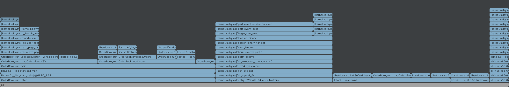
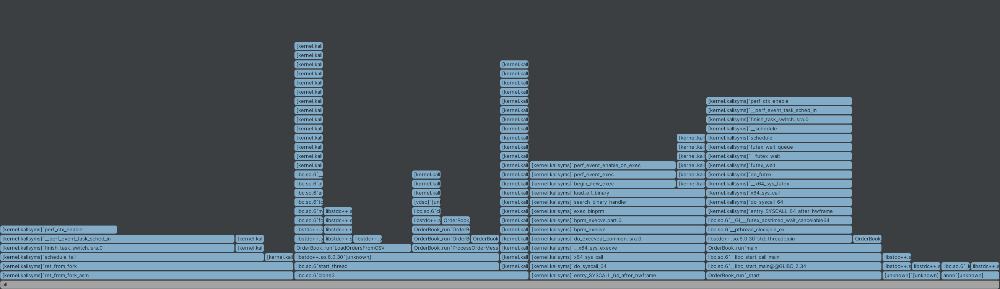

# Introduction

This repository presents a personal portfolio project, to demonstrate proficiency in C++, Python, CMake, and
performance measurement techniques, and an interest in low-latency systems and the financial domain.

The OrderBook implementation provides core functionalities, including the ability to add and cancel orders,
retrieve the best bid and ask prices, and compute the ask volume within specified price ranges.

The project is thoroughly unit-tested using the Google Test framework, with benchmarking and performance evaluations
conducted via Google Benchmark.

The dataset_creator/data_generator.py creates an example_dataset.csv that simulates incoming order messages.

The prices of orders are subject to random fluctuations, with biases designed to create upward and downward trends.
Prices remain closely correlated to facilitate a large volume of trades.

*Figure 1: Plot of prices created by the DataGenerator.py (plot by: plot_example_dataset_price.py)

The example dataset is processed by main.cpp, which uses the Orderbook class from OrderBook_lib.

# Version 1: std::priority_queue Implementation

This design was developed as a foundational exercise to establish the project architecture,
alongside unit testing and benchmarking capabilities.

The initial phase of this project involved a systematic approach, beginning with the integration of order management
into the OrderBook class. For this purpose, I employed `std::priority_queue`, which facilitates constant-time retrieval
of the optimal bid and ask prices—an essential feature for efficient trade execution. The bid and ask databases are
implemented as priority queues, with max-heaps for bids and min-heaps for asks.

However, this approach presents two notable limitations:

1. **Logarithmic Insertion**:  Orders are inserted with a time complexity of O(log N).
2. **Order Lookup**: Order Cancel, Best Bid, and Ask Volume all need Order lookup.
   Despite using hashmap for constant-time lookup of order IDs, priority_queue lacks direct removal from arbitrary
   indices.
   Cancelling an order requires popping elements to find the target, storing them temporarily, and then reinserting
   them.
   This results in O(NlogN) time and O(N) space complexity, where N is the lookup target order depth in the ask/bid
   priority queue.

***

## Benchmark results of Version 1:

 Benchmark system specs 

### Benchmark System Specifications

The benchmarks were conducted on an Ubuntu system equipped with an Intel Core i5-12400F processor, featuring 6 cores
with a clock speed of 4400 MHz. The processor’s cache configuration is as follows:

- **L1 Data Cache**: 48 KiB per core (6 cores total)
- **L2 Unified Cache**: 1280 KiB per core (6 cores total)
- **L3 Unified Cache**: 18,432 KiB / 18 MiB shared across all cores

The code was compiled using GNU GCC (g++) version 11.4.0, with the optimization flag `-O3` and the standard
`-std=gnu++20`, utilizing the C++20 language standard.

Tests executed with N in range 210 - 220, where N is the database size. The Time column and
AddOrder row therefore relates to adding an order to a database that already contains N orders.

| Test                      | Time Complexity | RMS  | Time min - max [ns]    |
|---------------------------|-----------------|------|------------------------|
| AddOrder_PriceRange_3     | 65.81 O(1)      | 10 % | 57.8 ns - 72.7 ns      |
| AddOrder_PriceRange_20    | 65.01 O(1)      | 5 %  | 58.4 ns - 65.1 ns      |
| Add1_Cancel1_Random_Order | 3.09 O(NlgN)    | 6 %  | 13867 ns - 65655574 ns |
| GetAskVolumeBetweenPrices | 4.66 O(NlgN)    | 2 %  | 25416 ns - 97618398 ns |
| GetBestBid                | 1.86 O(NlgN)    | 2 %  | 9610 ns - 38893371 ns  |

The insertion operation for `std::priority_queue` has a time complexity of O(log N), as detailed in the
[C++ reference documentation](https://en.cppreference.com/w/cpp/container/priority_queue).
In the Google benchmark, random prices within ranges of 3 and 20 were repeatedly added to the priority queue.
Given the high volume of operations and the absence of other CPU tasks during the benchmark, the operation appears
highly optimized, with performance approaching O(1). This suggests that the heap size has a minimal impact on
the time required to add additional elements.
The other results align with expectations, showing O(NlogN) complexity for order lookups,
as theoretically predicted.

***

# Version 2: std::map + std::list

Version 2 focuses on optimizing data structures to improve the O(NlogN) time complexity associated with key operations,
including retrieving the best bid, canceling orders, and querying ask volumes within a specified price range.
This design is motivated by insights from a notable blog
post: [How to Build a Fast Limit Order Book](https://web.archive.org/web/20110219163448/http://howtohft.wordpress.com/2011/02/15/how-to-build-a-fast-limit-order-book/).

In this implementation, each price level is represented by a `Level` object, which holds a bidirectional linked list
(`std::list`) for holding orders. The price levels themselves are organized using a balanced binary search tree
(`std::map`), ensuring logarithmic time complexity for insertion, cancellation, and lookup of price levels.
Due to the ordered nature of `std::map`, the best bid and best ask are always accessible at the boundaries,
allowing efficient retrieval of these values.
To enable faster random cancellation of orders, a hash map is used to provide direct access to orders based on their
unique IDs. Each `Order` object maintains a reference to its parent `Level` and its position within the linked list.
As a result, once an order is located via the hash map in O(1) average time, its removal from the linked list becomes
an O(1) operation.

## Benchmark results of Version 2:

 Benchmark system specs 

### Benchmark system specs

Testing was done on Ubuntu, with i5-12400F, 6cores, 4400Mhz. Cache sizes:

- **L1 Data**: 48 KiB (×6)
- **L2 Unified**: 1280 KiB (×6)
- **L3 Unified**: 18,432 KiB / 18 MiB (×1)

Compilation with GNU GCC (g++) 11.4.0, with -O3 and -std=gnu++20, so C++20 is used.

Tests executed with N in range 210 - 220, where N is the database size. The Time column and
AddOrder row
therefore relates to Adding an order to a database that already contains N orders.

| Test                      | Time Complexity | RMS  | Time  min - max   |
|---------------------------|-----------------|------|-------------------|
| AddOrder_PriceRange_3     | 84.26 O(1)      | 4 %  | 82.7 ns - 84.9 ns |
| AddOrder_PriceRange_20    | 84.65 O(1)      | 1 %  | 83.3 ns - 87 ns   |
| Add1_Cancel1_Random_Order | 22.76 O(lgN)    | 25 % | 190 ns - 569 ns   |
| GetAskVolumeBetweenPrices | 5.36 O(1)       | 5 %  | 5.04 ns - 5.86 ns |
| GetBestBid                | 0.58 O(1)       | 4 %  | 0.59 ns - 0.61 ns |

The results largely confirm the expected theoretical time complexities, except the
`Add1_Cancel1_Random_Order` test. This benchmark measures the time to cancel a random order, where the addition of an
order is not timed but included to maintain a consistent database size. The theoretical search complexity is average O(
1), but here logarithmic complexity is measured for the whole function.
Most tests were conducted with database sizes ranging from 1,024 to 1 million entries. The performance appears to be
influenced by the lookup efficiency of the `std::unordered_map` data structure.

## Profiling of Version2 dataset processing

The profiling results of the `main.cpp` are shown. `LoadOrderFromCSV` takes around 30% of all execution.
Execution of orders: `AddOrder`, `CancelOrder`, `GetBestBid`, `GetAskVolumeBetweenPrices` take similar amount of time,
around 30%.
Profiling results have low Precision, therefore these values vary, but nevertheless similar workload is observed.
Since orders could be loaded and executed right away this is good candidate for using multithreading.

# Multithreading for Dataset Processing (Ongoing Work)

As outlined in the profiling results, multithreading has been implemented to optimize dataset processing.
Two threads are utilized in this process: the first is responsible for loading new order messages from
the `example_dataset.csv` file, which is generated by the `data_generator.py` script, while the second thread
handles the processing of these incoming messages. Data is shared between the threads using a lock-free
`boost::spsc_queue`, which facilitates multithreading without the performance penalties typically associated
with mutex operations.

The figure above presents the flamegraph profiling results. In comparison to the single-threaded implementation,
the functions `LoadOrdersFromCSV` and `ProcessOrderMessages` now account for only approximately 20% of the total
execution time. However, the overhead introduced by multithreading, primarily due to task switching and thread
synchronization, is significant and dominates the overall execution time.
Ongoing work aims to examine and minimize this overhead and improve performance.

### Benchmarking Results

 Benchmark system specs 

### Benchmark system specs

Testing was done on Ubuntu, with i5-12400F, 6cores, 4400Mhz. Cache sizes:

- **L1 Data**: 48 KiB (×6)
- **L2 Unified**: 1280 KiB (×6)
- **L3 Unified**: 18,432 KiB / 18 MiB (×1)

Compilation with GNU GCC (g++) 11.4.0, with -O3 and -std=gnu++20, so C++20 is used.

| Test                                   | Time [ns]  | CPU Time [ns] |
|----------------------------------------|------------|---------------|
| BM_LoadAndExecuteMessages_SingleThread | 28,690,485 | 28,647,604    |
| BM_LoadAndExecuteMessages_MultiThread  | 21,309,110 | 47,295        |

