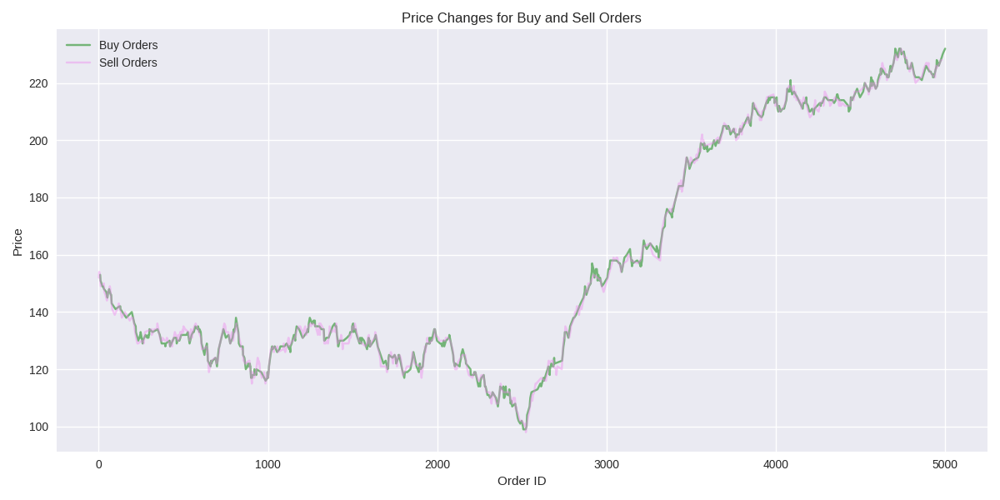

# OrderBook Implementation
This project focuses on the development of an OrderBook system through a series of progressively optimized versions. 
Each iteration is designed to achieve superior performance relative to its predecessors, while thoroughly analyzing and
documenting the advantages and limitations of each version. The system is rigorously evaluated using GoogleTest for unit
testing and GoogleBenchmark for performance benchmarking. 
Performance metrics are assessed at both the function level and the system-wide level. 
The **main.cpp** file simulates a simplified trading day, processing four distinct types of order messages sourced from
ExampleDataset.csv.

***

 Description of files and libraries 

### DatasetCreator
A python script that creates a .csv file, that simulates incoming order messages to theOrderBook.
Messages include: 
- Add Order
- Cancel Order
- Get Best Bid
- Get Ask Volume Between Prices

The price of orders randomly changes with biases to have an upward and downward trend, buy they move closely together to
trigger large amount of trades.

### Google Test
Google Test unit test framework is used to test correct execution of functions. AcceptanceTest.cpp contains all testcases.

### Google Benchmark
Google Benchmark framework is used to measure performance. 
Dataset_process_benchmark measures the execution time 
of the main.cpp function, that loads the ExampleDataset.csv then executes on the 
incoming order messages (add/cancel/bestBid/askVol). 
OrderBook_benchmark measures the asymptotic complexity of the 4 functions.

### OrderBook_lib
The Orderbook source files

## Initial "Naive" Version: std::priority_queue Implementation
The initial phase of this project involved a methodical approach, beginning with the integration of order management 
into the OrderBook class. For this purpose, I employed `std::priority_queue`, which facilitates constant-time retrieval 
of the optimal bid and ask prices—an essential feature for efficient trade execution. The bid and ask databases are 
implemented as priority queues, with max-heaps for bids and min-heaps for asks.

However, this approach presents two notable limitations:
1. **Logarithmic Insertion**:  Orders are inserted with a time complexity of \(O(\log N)\).
2. **Order Lookup**: Order Cancel, Best Bid, and Ask Volume all need Order lookup. 
Despite using hashmap for constant-time lookup of order IDs, priority_queue lacks direct removal from arbitrary indices. 
Cancelling an order requires popping elements to find the target, storing them temporarily, and then reinserting them. 
This results in \(O(N \log N)\) time and \(O(N)\) space complexity, where N is the lookup target order depth in the ask/bid priority_queue. 
This design was implemented as an initial step to practice coding, set up the project, and focus on unit testing and benchmarking.

***
### Benchmark results
| Function                  | Time Complexity | RMS  |
|---------------------------|-----------------|------|
| AddOrder_PriceRange_3     | 464.91 (1)      | 2 %  |
| AddOrder_PriceRange_10    | 386.12 (1)      | 5 %  |
| Add1_Cancel1_Random_Order | 34.48 NlgN      | 13 % |
| GetAskVolumeBetweenPrices | 66.50 NlgN      | 1 %  |
| GetBestBid                | 20.79 NlgN      | 3 %  |

The insertion operation for `std::priority_queue` has a time complexity of \(O(\log N)\), as detailed in the
[C++ reference documentation](https://en.cppreference.com/w/cpp/container/priority_queue). 
In the Google benchmark, random prices within ranges of 3 and 10 were repeatedly added to the priority queue. 
Given the high volume of operations and the absence of other CPU tasks during the benchmark, the operation appears 
highly optimized, with performance approaching O(1). This suggests that the heap size has a minimal impact on 
the time required to add additional elements. The relatively large constant factor of 465 indicates that the operation's
baseline cost is non-trivial. Furthermore, the benchmark demonstrates a slight performance improvement with a larger 
price range of 10, likely due to a more even distribution of elements within the underlying container. 
The other results align with expectations, showing \(O(N \log N)\) complexity for order lookups, 
as theoretically predicted.

***